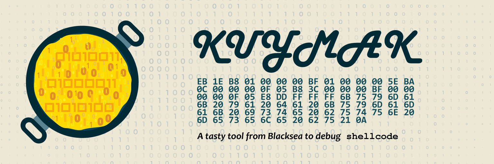

# Kuymak



A tasty cross-platform tool from Blacksea to inspect/debug/run shellcode.

**Linguistic info**: [Kuymak][web-wiki-kuymak] is a regional meal of Turkey's
Black Sea Region.

```txt
    __________________________________________________________________
   |         ...-...  .'\\   _   __                            _      |
   |      ./sh0mmm0hs+\  o  | | / /                           | |     |
   |    ./hmPS1SSSSSSm0y/:  | |/ / _   _ _   _ _ __ ___   __ _| | __  |
   |    +mq00000000000pm+   |    \| | | | | | | '_ ` _ \ / _` | |/ /  |
   |   .mq0001010011000pm.  | |\  \ |_| | |_| | | | | | | (_| |   <   |
 +=|   .mq0001000011000pm.  \_| \_/\__,_|\__, |_| |_| |_|\__,_|_|\_\  |=+
 | |    +mq00101010000pm+                 __/ |                       | |
 | |   //yomooooooooom0+.                |___/ github.com/blue-devil/ | |
 | |   \  y+sh0mmm0hs/.                                               | |
 | |    `-'  '''-''' To kuymak or not to kuymak, that's the question! | |
 | |__________________________________________________________________| |
 |         ____________________________________________________         |
 |      -+| @author   : Blue DeviL <bluedevil.SCT@gmail.com>   |+-      |
 |     |  | @version  : 0.3.0                                  |  |     |
 +<===>+--| @date     : 23/08/2022                             |--+<===>+
       |  | @license  : GPLv3                                  |  |
        -+| @info     : Cross-platform shellcode runner        |+-
          |____________________________________________________|

KUYMAK v0.3

[*] USAGE:
        kuymak -b shellcode.bin
        kuymak -k \x0f\x01\xf8\xe8\5\0\0\0\x0f\x01\xf8\x48\xcf

[*] Options:
        -b      shellcode as a binary
        -k      shellcode as char array (not implemented yet)
        -h      prints this help
```

## Usage

Save your shellcode as a binary file. You can use HxD, xxd or use your
favourite editor. Then give this shellcode binary with parameter `-b`.

```txt
kuymak -b shellcode.bin
```

**TODO**: Give shellcode as a char array from commandline

## Requirements

You only need GCC to build Kuymak.

* Linux
  * Arch Linux/Manjaro: `sudo pacman -S base-devel`
  * Pisi GNU/Linux: `sudo pisi it gcc`
  * Fedora: `sudo dnf install gcc-c++ make`
  * Debian/Kali/Ubuntu: `sudo apt install build-essential`
* macOS
  * Open terminal and run this command: `xcode-select --install`
* Windows
  1. Install Mingw-w64 via [MSYS2][web-msys2]. Download the installer and
     install it.
  2. Alternatively you can use winget: `winget install -e --id msys2.msys2`
  3. After installation fire up MSYS2 shell and run:
     `pacman -S --needed base-devel mingw-w64-x86_64-toolchain`

## Building

If you have GCC on your system building is very straightforward:

**LINUX**:

```txt
gcc -Wall kuymak.c -o kuymak
```

**WINDOWS**:

Windows x86_64:

```txt
x86_64-w64-mingw32-gcc -Wall kuymak.c -o kuymak
```

Windows x86_32:

```txt
i686-w64-mingw32-gcc -Wall kuymak.c -o kuymak
```

**APPLE**:

```txt
gcc -Wall kuymak.c -o kuymak
```

## TODO

* [x] Make a version for macOS(use `__APPLE__` preprocessor expression)
* [x] Create a shellcode runner
* [x] Ask user if he/she wants to run shellcode or not
* [ ] Get rid of unistd+getopt dependency
* [ ] Can we compile it with cl? Look for a workaround
* [x] Add changelog
* [x] Add, macOS "Hello, world!" shellcode
* [x] Publish releases
* [ ] Shellcode in a new thread; do we need that?
* [x] Add, linux "Hello, world!" shellcode
* [ ] Publish ARM releases
* [x] Parse and execute shellcode from console

## Further Reading & Resources

Checkout other shellcode runner/debugger, pe2shellcode projects:

* [BlobRunner][web-github-blobrunner]
* [Crab-Runner][web-github-crabrunner]
* [ShellcodeCompiler][web-github-sccompiler]
* [pe_to_shellcode][web-github-pe_to_sc]
* [PE2Shellcode][web-github-pe2sc]
* [Shellcode Tester][web-github-sctester]

## LICENSE

This project is licensed under GPLv3

[web-github-blobrunner]: https://github.com/OALabs/BlobRunner
[web-github-crabrunner]: https://github.com/cdong1012/Crab-Runner
[web-github-sccompiler]: https://github.com/NytroRST/ShellcodeCompiler
[web-github-pe_to_sc]: https://github.com/hasherezade/pe_to_shellcode
[web-github-pe2sc]: https://github.com/d35ha/PE2Shellcode
[web-github-sctester]: https://github.com/tophertimzen/shellcodeTester
[web-msys2]: https://www.msys2.org/
[web-wiki-kuymak]: https://en.wikipedia.org/wiki/Kuymak
